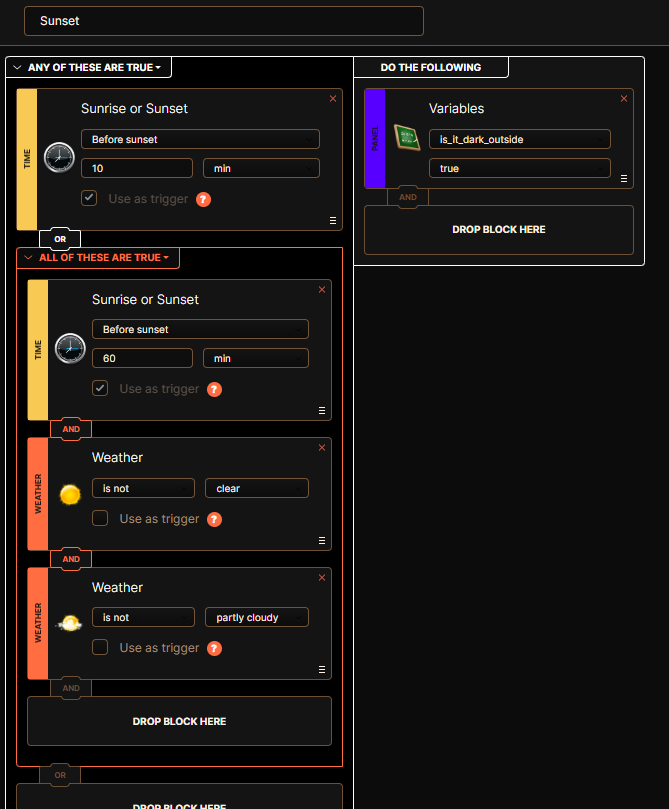
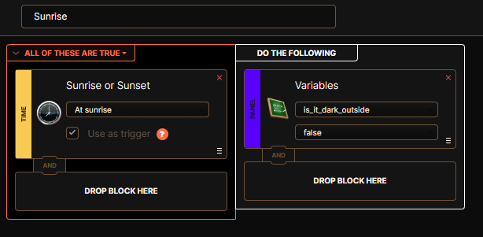
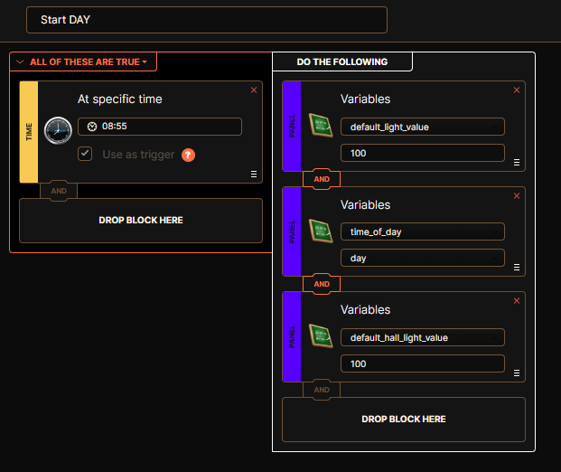
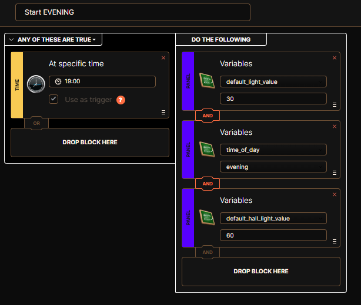
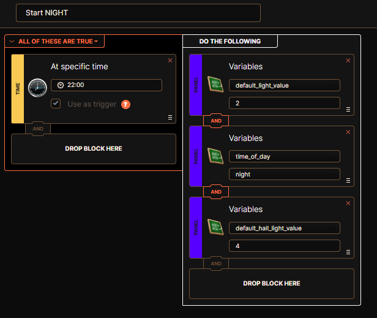

# Global Variables Setup Guide

This guide explains how to set up the global variables required by various scenes in this repository. These variables help scenes make intelligent decisions based on time of day and lighting conditions.

## Required Global variables

### 1. `is_it_dark_outside`
- **Type**: Enumerated variable
- **Purpose**: Indicates whether it's currently dark outside
- **Used by**: Improved Dimmer, RGBW LED scenes
- **Values**: `true` (dark) or `false` (light)

### 2. `default_light_value`
- **Type**: Standard variable
- **Purpose**: Default brightness level for lights based on time of day
- **Used by**: RGBW LED scene
- **Values**: Brightness percentage (0-100)
  
To create the required global variables, go to Fibaro HC3 web interface, 
navigate to **Settings** → **General** → **Variables** and click **Add Variable**.

## Setting up `is_it_dark_outside` variable

To automatically manage the `is_it_dark_outside` variable, you need to create two block scenes:

### Sunset scene

### Sunrise scene  

## Setting up `default_light_value` Variable

To automatically adjust lighting values throughout the day, create multiple time-based scenes:

### Day scene

### Evening scene

### Night scene

## Customization Options

- **Adjust timing**: Modify the specific times in each scene to match your schedule
- **Add more time periods**: Create additional scenes for morning, afternoon, late night, etc.
- **Seasonal adjustments**: Create different scenes for different seasons
- **Weather integration**: Add weather condition blocks for more intelligent responses
- **Room-specific variables**: Create additional variables for specific rooms or device types
